# Genova - Architecture Système
## Diagrammes et Schémas Techniques

---

## 1. Architecture Globale du Système

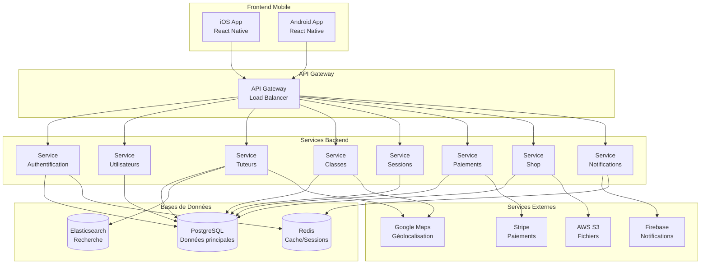

---

## 2. Flux d'Inscription et Matching

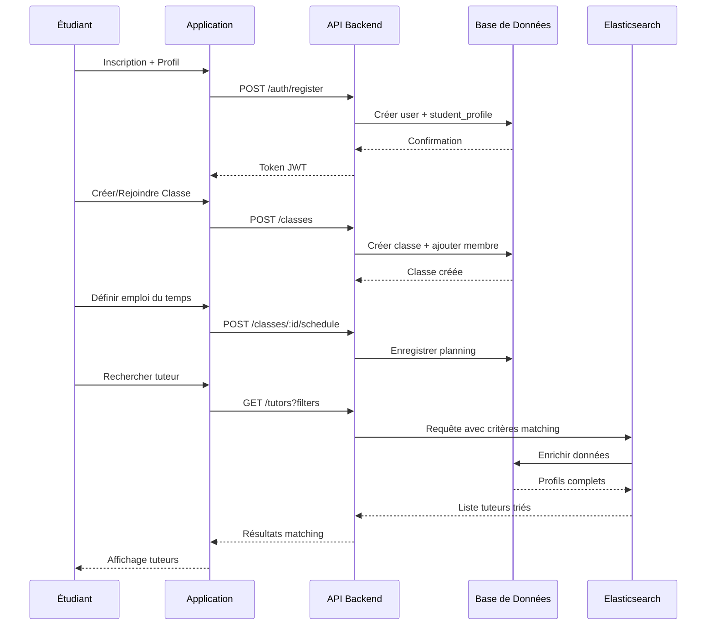

---

## 3. Flux de Réservation et Paiement

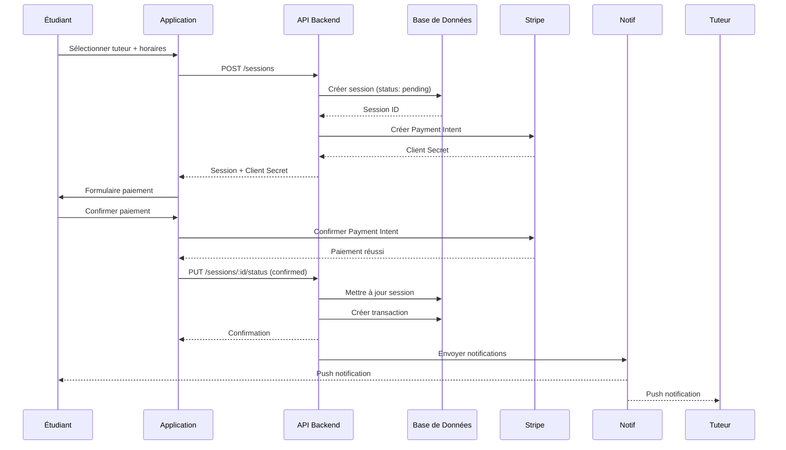

---

## 4. Diagramme de Classes (Modèle de Données)

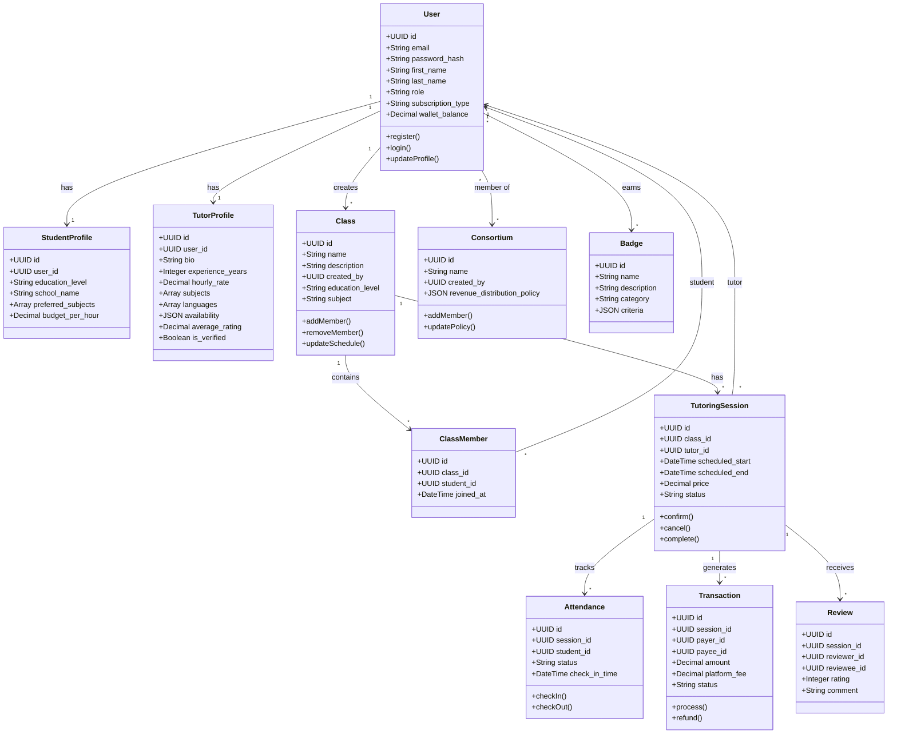

---

## 5. Architecture des Services (Microservices)

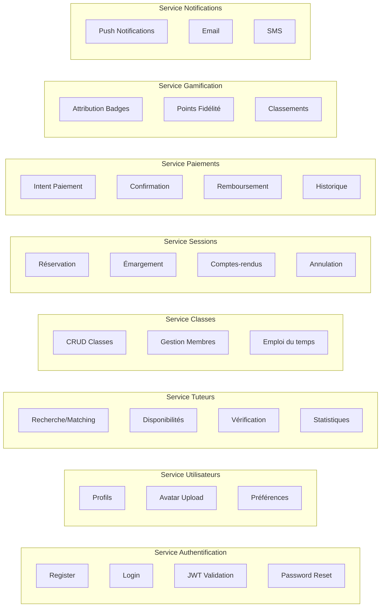

---

## 6. Flux de Matching Tuteur (Algorithme)

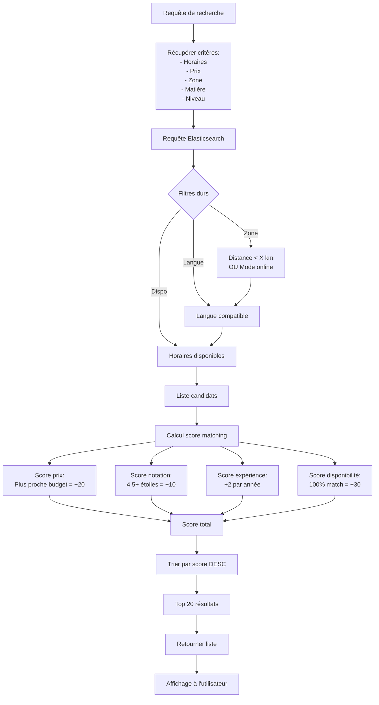

---

## 7. Flux de Gamification

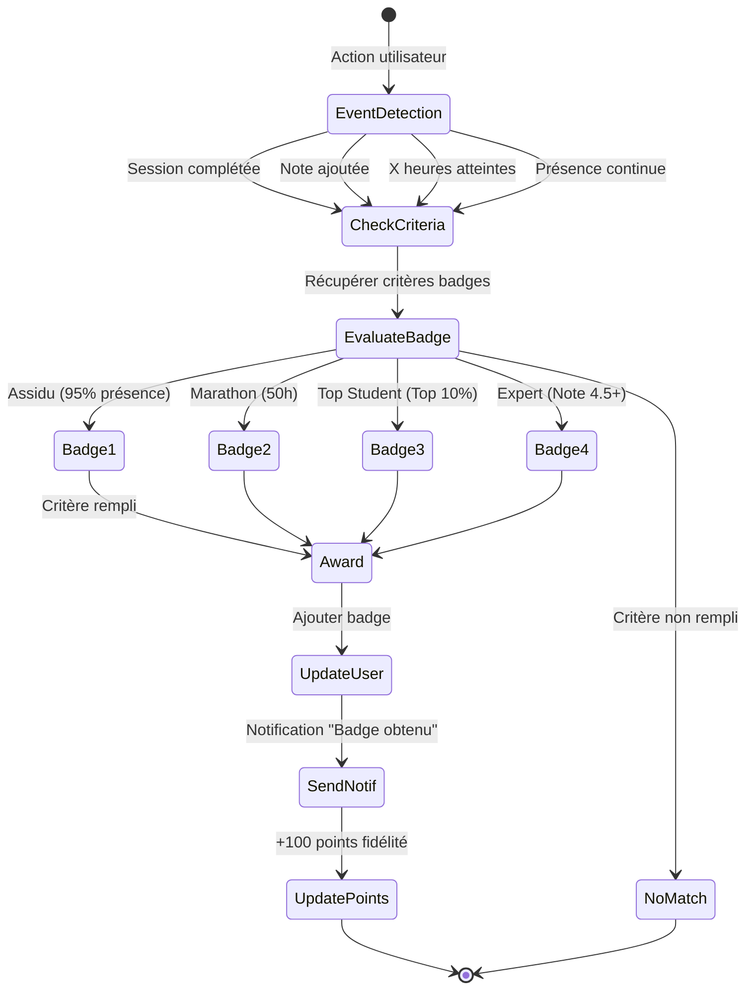

---

## 8. Architecture de Sécurité

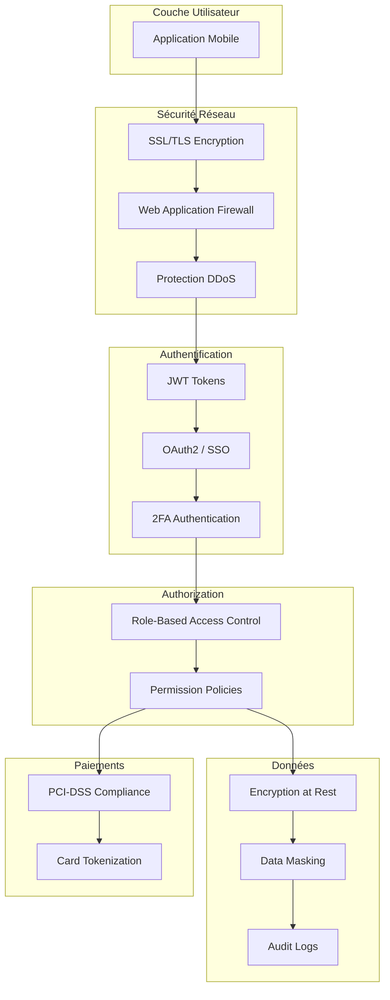

---

## 9. Infrastructure Cloud (AWS)

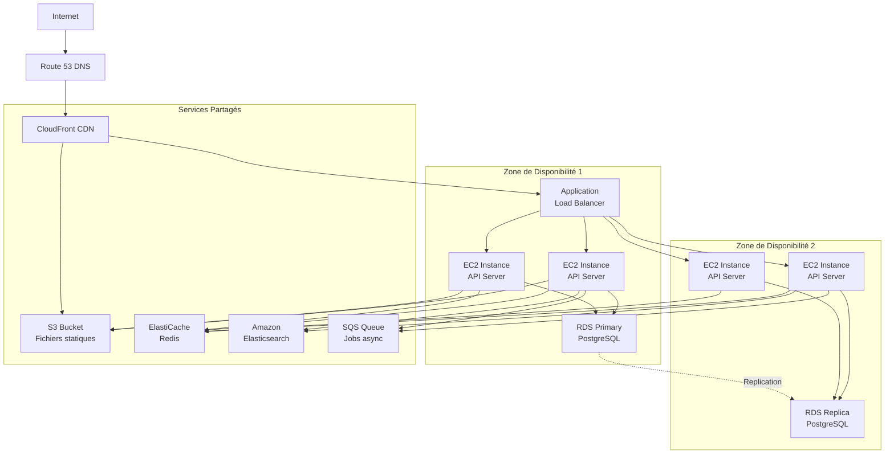

---

## 10. Pipeline CI/CD

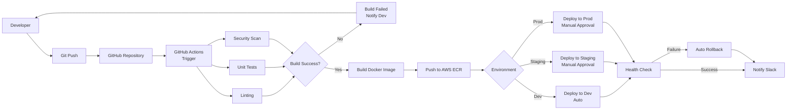

---

## 11. Stratégie de Monitoring

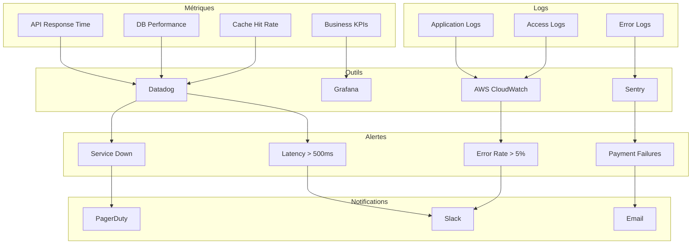

---

## 12. Stratégie de Scalabilité

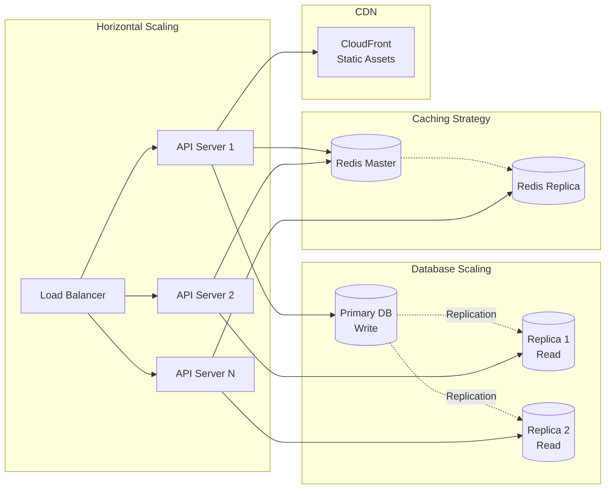

---

Ce document présente l'architecture technique complète de Genova avec tous les diagrammes nécessaires pour comprendre le système, ses flux de données, sa sécurité et sa scalabilité.